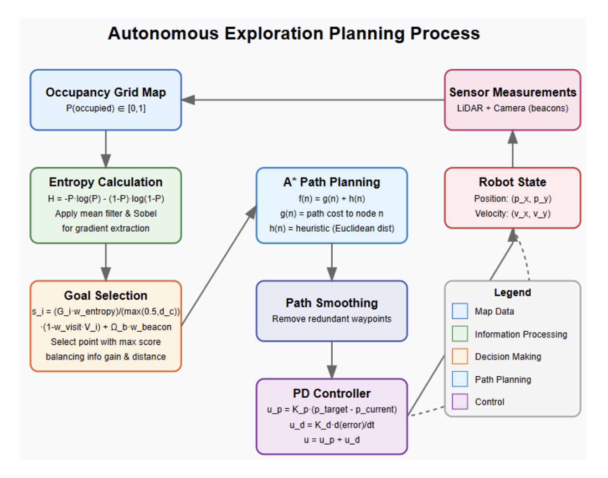

# Autonomous Exploration of Unknown Environments (via SLAM + Entropy-Informed A* Exploration)

## Contributors
Gio Huh, Taekyung Lee, Gavin Hua

## Overview
Our system demonstrates a comprehensive **SLAM architecture** integrating **particle filter localization** with **log-odds occupancy grid mapping**. Key innovations include **information-theoretic exploration** using **entropy gradient analysis**, hybrid beacon mapping combining particle and Kalman filter approaches, and **entropy-informed A* path planning**.


The implementation features robust sensor fusion of LiDAR and landmark measurements, physics-based simulation modeling sensor noise and collision dynamics, and adaptive waypoint tracking with proportional-derivative control for autonomous navigation in unknown environments.



## Technical Report
For detailed algorithm descriptions, implementation details, ablation study, and evaluation metrics, see our technical report and full video:

1. [Technical Report](https://drive.google.com/file/d/1aAcD-nnV9_3NcpWFxjNht4pzLu0-9uYG/view?usp=sharing)
2. [Full Video](https://drive.google.com/file/d/1tzxq5DwKlgvJD8ZG-EpkwTZMMa1Of0hN/view?usp=sharing)

## Architecture
The system consists of four primary ROS 2 nodes:

1. **SLAM Node**: Implements particle filter localization and occupancy grid mapping
2. **Planner Node**: Manages exploration strategy using entropy gradient analysis
3. **Controller Node**: Executes path following with PD control
4. **Physics Simulation Node**: Simulates robot dynamics, sensors, and interactions

## Core Technical Components

### Particle Filter Localization
- Non-parametric state estimation with importance sampling
- Beacon-based inverse-distance scoring function
- Softmax resampling with adaptive noise injection

### Occupancy Grid Mapping
- Log-odds ratio update with saturation bounds
- Bresenham ray-casting for LiDAR updates
- Dual-approach beacon mapping:
 - Particle clustering with voting-based correspondence
 - Information fusion with Kalman filter updates

### Entropy-Driven Exploration
- Entropy gradient extraction for frontier detection
- Multi-factor goal selection integrating:
 - Information gain potential
 - Distance cost
 - Exploration direction continuity
 - Localization reliability near beacons

### Path Planning & Control
- A* path generation with occupancy-aware collision checking
- Adaptive waypoint tracking
- PD control with velocity constraints

## Installation

### Prerequisites
- ROS 2 (Foxy or later)
- Python 3.6+
- NumPy
- Shapely (for collision detection)

### Setup
After cloning the repository:
```sh
# Install required Python packages
pip install -r requirements.txt

# Build the ROS 2 package
cd multi_slam_ws
colcon build
source install/setup.bash
```

## Usage

### Running the System
```sh
# Launch the complete system
ros2 launch multi_slam multi_slam_launch.py
```

### Parameter Configuration
Parameters can be configured at launch time:
```sh
ros2 launch multi_slam multi_slam_launch.py max_speed:=2.0 teleop_enabled:=true
```

### Teleoperation
When teleoperation is enabled, use the following keys:
- `w`: Forward
- `s`: Backward
- `a`: Left
- `d`: Right
- `x`: Stop
- `q`: Quit

## ROS 2 Topic Structure
### Core Communication Topics
- `control_signal`: Velocity commands for robot actuation (`Vector3`)
- `/lidar`: LiDAR point cloud measurements (`PointCloud2`)
- `/beacon`: Detected landmark measurements (`PointCloud2`)
- `/estimated_pose`: SLAM-derived robot position estimate (`PoseStamped`)
- `/occupancy_grid`: Probabilistic environment representation (`OccupancyGrid`)
- `/planned_control`: Autonomous navigation commands (`Vector3`)
- `/planning_status`: Planner state indication (`Bool`)

### Synchronization Mechanism
- `/slam_done`: SLAM cycle completion notification (`Bool`)
- `/sim_done`: Physics simulation step completion (`Bool`)

### Visualization and Analysis Topics
- `visualization_marker_true`: Ground truth robot position (`Marker`)
- `/pos_hat_viz`: Particle filter position estimate (`Marker`)
- `/estimated_beacons`: Mapped landmark positions with uncertainty (`MarkerArray`)
- `/particles`: Particle filter state distribution (`PointCloud2`)
- `/planned_path`: Generated trajectory (`Marker`)
- `/goal_point`: Current exploration target (`Marker`)
- `/entropy_map`: Information density visualization (`OccupancyGrid`)
- `/boundary_map`: Exploration frontier visualization (`OccupancyGrid`)
- `/rrt_tree`, `/rrt_nodes`, `/rrt_samples`: Path planning debug information (`Marker`)

## Node Configuration

### PhysicsSimNode
Implements physics simulation with sensor modeling and collision detection.

#### Parameters:
- `lidar_r_max`, `lidar_r_min`: LiDAR range bounds (10.0m, 0.1m)
- `lidar_delta_theta`: Angular resolution (3 degrees)
- `lidar_std_dev`: Measurement noise standard deviation (0.1m)
- `beacon_std_dev`: Landmark detection noise (0.1m)
- `vel_std_dev`: Process noise in velocity commands (0.4)
- `collision_buffer`: Robot-obstacle collision radius (0.1m)
- `collision_increment`: Sub-step size for collision detection (0.02m)
- `sim_dt`: Integration time step (0.1s)

### PlannerSLAMNode
Integrates localization, mapping, and exploration planning.

#### Parameters:
- `map_size_x`, `map_size_y`: Map dimensions (50.0m)
- `map_origin_x`, `map_origin_y`: Map origin coordinates (-25.0m)
- `grid_size`: Occupancy grid resolution (0.1m)
- `num_particles`: Particle filter population size (1000)
- `position_std_dev`: Motion model noise (0.1m)
- `initial_noise`: Initial uncertainty radius (0.5m)
- `use_planner`: Enable autonomous exploration (True)
- `rrt_step_size`: Path planning step increment (0.5m)
- `rrt_max_iter`: Maximum planning iterations (500)
- `rrt_goal_sample_rate`: Goal biasing probability (5%)
- `pd_p_gain`, `pd_d_gain`: Controller gains (1.0, 0.1)
- `entropy_weight`: Information content weighting (1.0)
- `beacon_weight`: Localization reliability weighting (2.0)
- `beacon_attraction_radius`: Landmark detection bias (3.0m)

### PlannerControllerNode
Manages navigation with fallback capability.

#### Parameters:
- `max_speed`: Velocity constraint (1.0m/s)
- `control_frequency`: Command update rate (10.0Hz)
- `use_manual_fallback`: Enable safety fallback mode (True)
- `fallback_control_x`, `fallback_control_y`: Default motion vector (0.0, 0.5)

### Teleop Keyboard Node
Provides keyboard-based teleoperation.

#### Parameters:
- `max_speed`: Maximum robot speed (1.0m/s)
- `publish_rate`: Command publish rate (20.0Hz)
